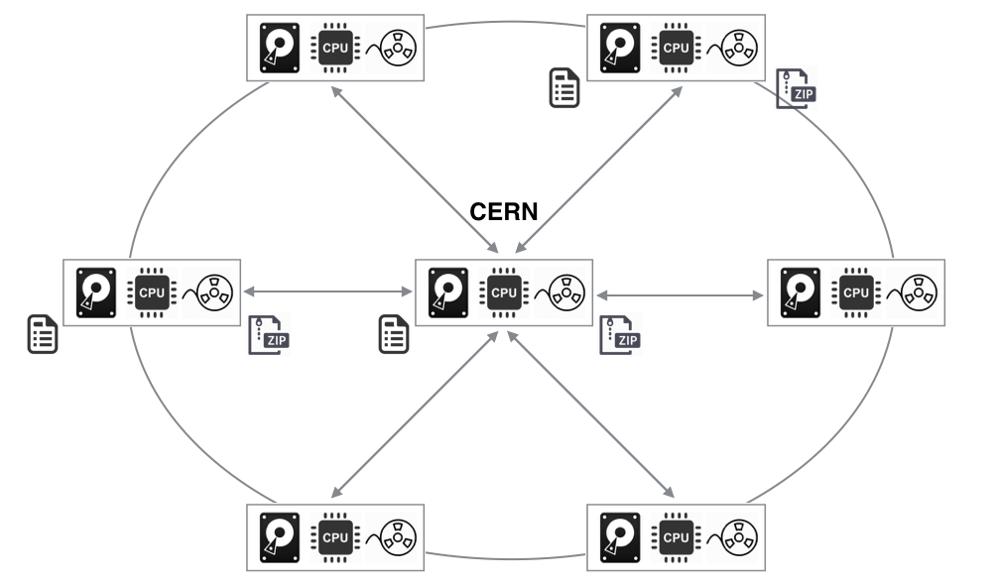
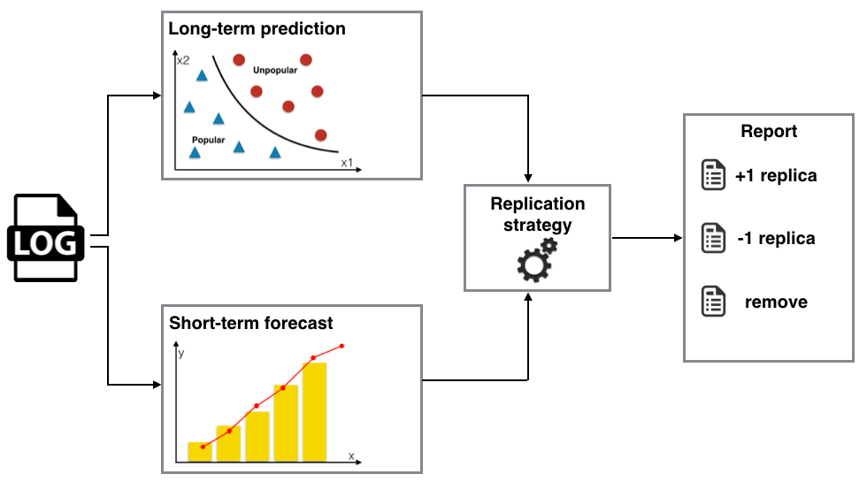

# DataPopularity

## Introduction
The LHCb collaboration is one of the four major experiments at the Large Hadron Collider at CERN. The detector, as well as the Monte Carlo simulations of physics events, create PBs of data every year. The data needs to be distributed to multiple locations to be available for thousands researchers around the world. For this the LHCb data grid is used. 

The LHCb data grid has a Tier-1 center at CERN and six aditional regional Tier-1 and 14 Tier-2 centers around the world. The Tier-1s are the most important because they are responsible for all the production-processing phases associated with the real data. The Tier-1s are used for generating RAW data, reconstruction, stripping and user analysis. The center at CERN is also used for generating RAW data. The Tier-2s are used for Monte-Carlo production which is then uploaded to the Tier-1s.

Each Tier-1 has CPUs, disk and tape storages. The tapes are used for archiving the data. The disks keep data which is currently used in user analysis. To meet the needs for scalability, fast access and user collaboration, each dataset has several replicas distributed over the Tier-1s. This provides faster access to datasets for users and the preservation of a network bandwidth because replicas can be placed close to centers where users need them. But creation of replicas is bound by the availability of storage within centers.

In this study we determine for which datasets number of replicas can be decreased or increased, which datasets likely will not be used in ruture and can be removed from disks.

## Method description

### General concept

Using log files we predict probabilities that the datasets will be accessed in long-term future (6  months, 1 year) using machine learning algorithms. Moreover, time series analysis algorithms are used to predict the datasests number of accesses in short-term future (1 week, 1 month). Based on the probabilities and the the predicted number of accesses we determine which datasets number of replicas should be increased or decreased first and which datasets can be removed from disk.

### Long-term prediction

Each dataset was described by the following features: recency, reuse distance, time of the first access, creation time, access frequency, type, extention and size. The reuse distance is the difference between the last access and the second last access. We use these features and the datasets access history to train the classifier. Then, the trained classifier is used to predict probabilities that the datasets will be accessed in long-term future.

### Short-term forecast

Using the datasets access history and time series analysis to predict number of accesses for the next period of time. In this study we use the Brown model of exponential smoothing.

### Replication strategy

The proposed replication strategy is based on the following key points: the datasets with low (<=0.01) probabilities to be accessed in long-term future can be removed from disks; decrease number of replicas for the datasets with low predicted number of accesses and which have a lot of replicas first; increase number of replicas for the datasets with hight predicted number of accesses and which have a few replicas first. For each dataset we calculate metric value: predicted_number_of_accesses / number_of_replicas. Then, number of replicas decreased/increased by 1 for the dataset with the lowest/highest metric value first.

Increasing/decreasing number of replicas and removing the datasets can be done separately depending on how much free disk space you have or how much space you want to save.

### Report

The our method generates three reports which are contain recommendation of which datasets number of replicas can be decreased to save N Tb or increased to fill N Tb, which datasets likely will not be used in ruture and can be removed from disks to save N Tb.
